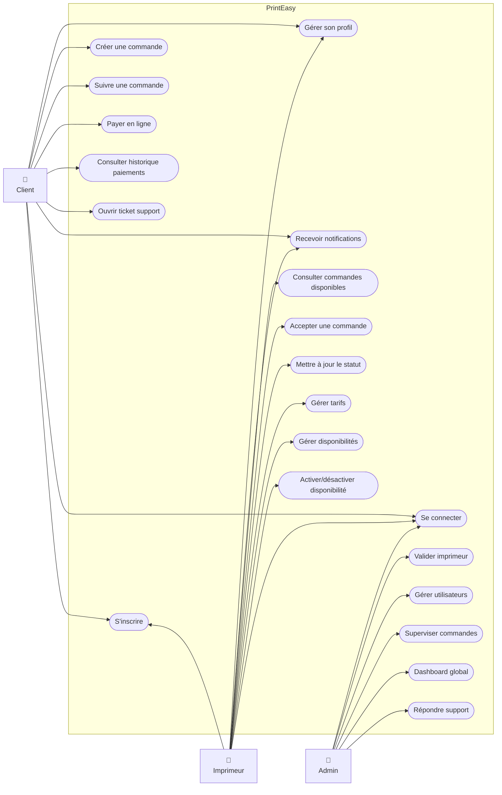
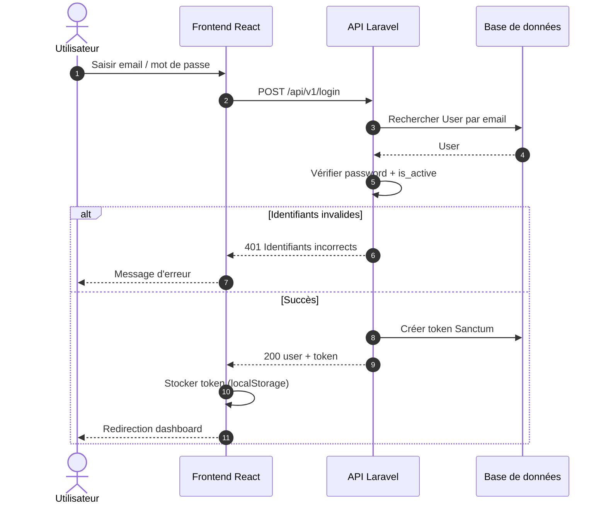
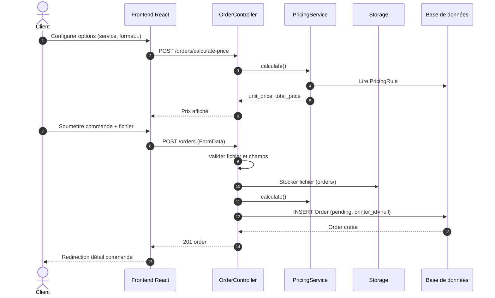
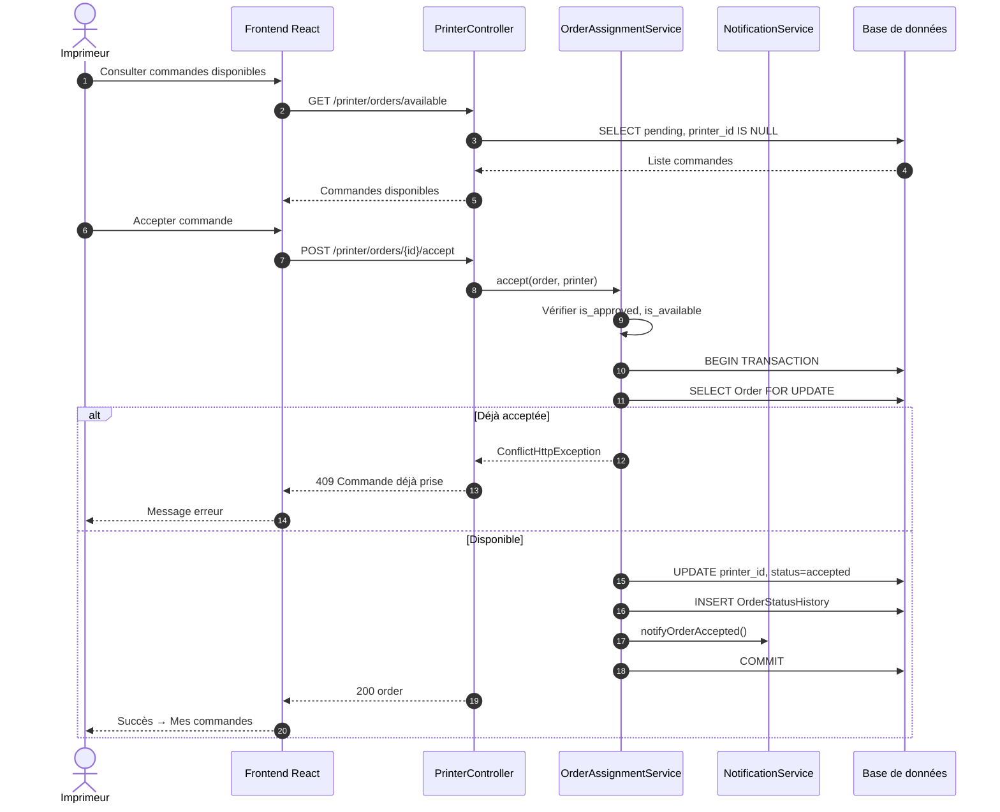
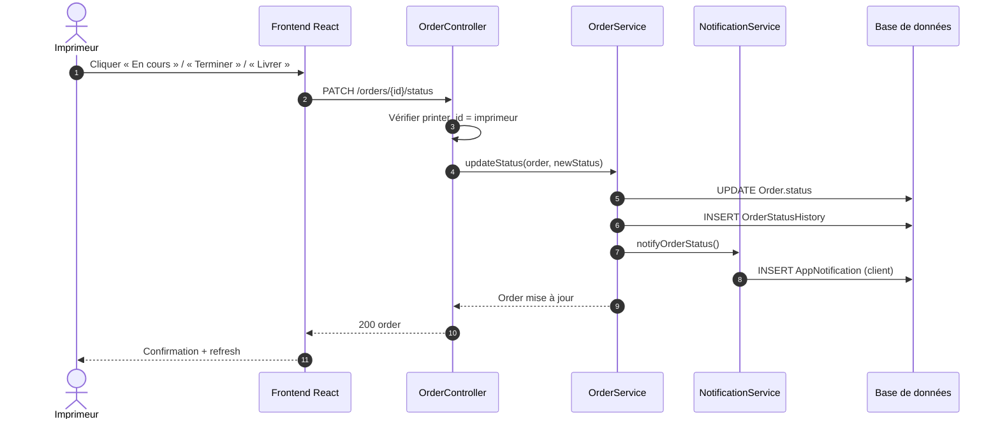
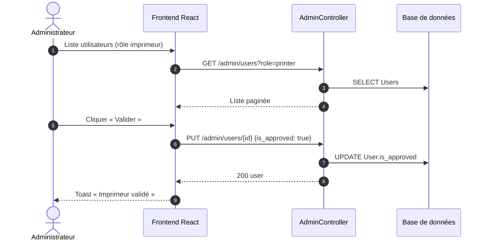
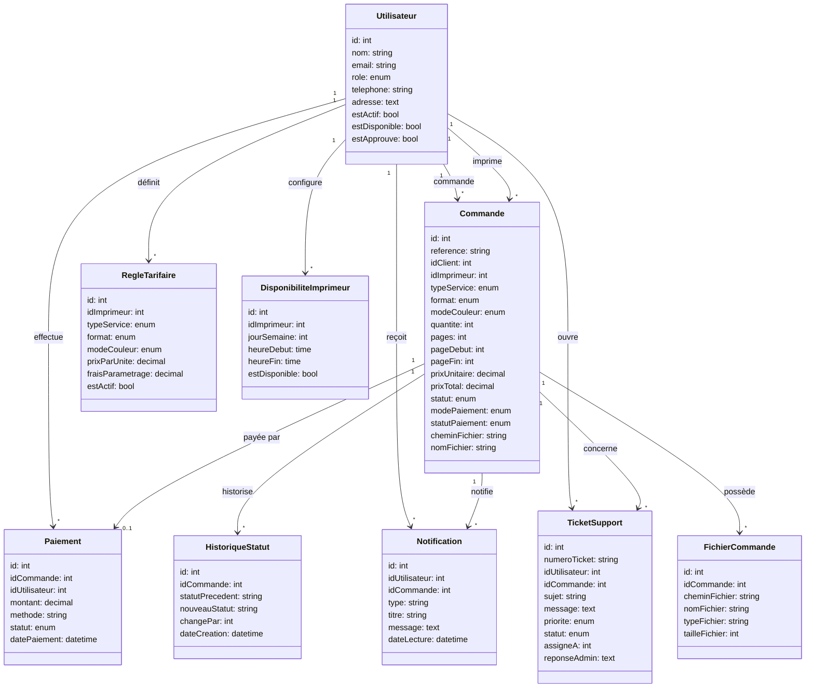

# Cahier d'analyse — PrintEasy

**Plateforme web de gestion des services d'impression, photocopie et scan**

---

## Informations du document

| Champ | Valeur |
|-------|--------|
| **Projet** | PrintEasy |
| **Document** | Cahier d'analyse |
| **Version** | 1.2 |
| **Date** | 2026 |

---

## Sommaire

- I. [Modules et fonctionnalités](#i-modules-et-fonctionnalités)
- II. [Acteurs / utilisateurs](#ii-acteurs--utilisateurs)
- III. [Objets du système](#iii-objets-du-système)
- IV. [Diagramme de cas d'utilisation](#iv-diagramme-de-cas-dutilisation)
- V. [Diagrammes de séquence](#v-diagrammes-de-séquence)
- VI. [Diagramme de classes](#vi-diagramme-de-classes)
- VII. [Règles de gestion](#vii-règles-de-gestion)

---

## I. Modules et fonctionnalités

Pour les besoins du système PrintEasy, **5 modules** ont été identifiés :

- **Tableau de bord** — Vue synthétique par rôle (client, imprimeur, admin)
- **Commandes** — Création, file d'attente, attribution, suivi des statuts
- **Paramètres** — Tarifs, disponibilités, profil utilisateur
- **Paiements** — Paiement en ligne simulé, historique, reçus
- **Sécurité** — Authentification, rôles, validation des imprimeurs (module transversal)

| MODULES | FONCTIONNALITÉS |
|---------|-----------------|
| **Tableau de bord** | 1. Afficher les indicateurs clés (commandes en attente, en cours, revenus)<br>2. Accès rapide aux actions principales<br>3. Toggle disponibilité (imprimeur) |
| **Commandes** | 1. Créer une commande (upload fichier, options, calcul prix)<br>2. Consulter la file des commandes disponibles (imprimeur validé)<br>3. Accepter une commande (attribution exclusive, premier arrivé)<br>4. Mettre à jour les statuts (en cours, terminée, livrée)<br>5. Consulter le détail et l'historique des statuts<br>6. Rechercher et filtrer les commandes |
| **Paramètres** | 1. Gérer le profil (nom, téléphone, adresse, mot de passe)<br>2. Définir la grille tarifaire (imprimeur)<br>3. Configurer les horaires de disponibilité (imprimeur) |
| **Paiements** | 1. Payer une commande en ligne (simulé)<br>2. Choisir paiement à la réception<br>3. Consulter l'historique et télécharger un reçu |
| **Sécurité** | 1. Inscription et connexion (Sanctum)<br>2. Gestion des rôles (client, imprimeur, admin)<br>3. Activer / désactiver les comptes<br>4. Valider / révoquer les comptes imprimeur (`is_approved`) |

---

## II. Acteurs / utilisateurs

Le tableau ci-dessous définit les intervenants du système pour chaque module :

| MODULES | INTERVENANTS |
|---------|--------------|
| **Tableau de bord** | Client, Imprimeur, Administrateur |
| **Commandes** | Client, Imprimeur (validé et disponible), Administrateur |
| **Paramètres** | Client, Imprimeur, Administrateur |
| **Paiements** | Client, Administrateur |
| **Sécurité** | Client, Imprimeur, Administrateur |
| **Support / Notifications** | Client, Administrateur |

### Description des acteurs

| Acteur | Description |
|--------|-------------|
| **Client** | Utilisateur qui dépose des fichiers, passe commande, paie et suit l'avancement |
| **Imprimeur** | Prestataire qui consulte la file, accepte des commandes, met à jour les statuts et gère tarifs/disponibilités |
| **Administrateur** | Supervise la plateforme, valide les imprimeurs, modère les comptes et consulte les statistiques globales |
| **Système (API)** | Backend Laravel : validation, calcul des prix, verrouillage d'attribution, notifications |

---

## III. Objets du système

Un **objet** est un élément abstrait du système disposant d'attributs et représentant un ensemble d'entités manipulées par la plateforme.

### Vue d'ensemble des objets

```
User ── Order ── Payment
  │       │
  │       ├── OrderStatusHistory
  │       ├── AppNotification
  │       ├── SupportTicket
  │       └── OrderFile
  ├── PricingRule
  └── PrinterAvailability
```

### Interprétation du schéma des objets

Ce schéma résume les **liens principaux** entre entités :

- **User** est l'entité centrale : un même modèle représente client, imprimeur et admin (discriminé par `role`).
- **Order** relie un **client** (`user_id`) à un **imprimeur** (`printer_id`, optionnel tant que la commande n'est pas acceptée).
- **Payment** est rattaché à une commande et au payeur.
- **OrderStatusHistory**, **AppNotification** et **SupportTicket** gravitent autour de **Order** pour la traçabilité, l'information et le support.
- **PricingRule** et **PrinterAvailability** dépendent de l'imprimeur (User avec rôle `printer`) pour la tarification et les horaires.

---

### User

L'objet **User** représente l'ensemble des utilisateurs gérés dans le système (client, imprimeur, administrateur).

| ATTRIBUTS | TYPE | OBSERVATIONS |
|-----------|------|--------------|
| id | integer | Clé primaire |
| name | string | Nom ou nom de l'imprimerie |
| email | string | Unique |
| password | string | Hashé |
| role | enum | `user`, `printer`, `admin` |
| phone | string | Nullable |
| avatar | string | Nullable |
| address | text | Nullable (obligatoire à l'inscription imprimeur) |
| is_active | boolean | Compte actif |
| is_available | boolean | Imprimeur disponible pour nouvelles commandes |
| is_approved | boolean | Validation admin (imprimeur) |
| email_verified_at | datetime | Nullable |
| created_at / updated_at | datetime | Horodatage |

---

### Order

L'objet **Order** représente une demande d'impression, photocopie ou scan.

| ATTRIBUTS | TYPE | OBSERVATIONS |
|-----------|------|--------------|
| id | integer | Clé primaire |
| reference | string | Unique (ex. PE-XXXXXXXX) |
| user_id | integer | FK → Client commanditaire |
| printer_id | integer | FK → Imprimeur (nullable jusqu'à acceptation) |
| service_type | enum | `print`, `photocopy`, `scan` |
| format | enum | `A4`, `A3`, `A5`, `letter` |
| color_mode | enum | `color`, `bw` |
| quantity | integer | Nombre d'exemplaires |
| pages | integer | Nombre de pages |
| page_start | integer | Page de début (nullable) |
| page_end | integer | Page de fin (nullable) |
| unit_price | decimal | Prix unitaire calculé |
| total_price | decimal | Montant total |
| status | enum | `pending`, `accepted`, `in_progress`, `completed`, `delivered`, `rejected`, `cancelled` |
| payment_method | enum | `online`, `on_delivery` |
| payment_status | enum | `unpaid`, `pending`, `paid`, `refunded` |
| file_path | string | Chemin stockage |
| file_name | string | Nom original du fichier |
| file_type | string | MIME type |
| file_size | integer | Octets |
| notes | text | Nullable |
| rejection_reason | text | Nullable |
| accepted_at | datetime | Date d'acceptation par l'imprimeur |
| completed_at | datetime | Nullable |
| created_at / updated_at | datetime | Horodatage |

---

### PricingRule

L'objet **PricingRule** représente une règle tarifaire définie par un imprimeur.

| ATTRIBUTS | TYPE | OBSERVATIONS |
|-----------|------|--------------|
| id | integer | Clé primaire |
| printer_id | integer | FK → User (imprimeur), nullable = tarif global |
| service_type | enum | print, photocopy, scan |
| format | enum | A4, A3, A5, letter |
| color_mode | enum | color, bw |
| price_per_unit | decimal | Prix par unité/page |
| setup_fee | decimal | Frais fixes |
| is_active | boolean | Règle active |

---

### PrinterAvailability

L'objet **PrinterAvailability** représente les créneaux horaires d'un imprimeur.

| ATTRIBUTS | TYPE | OBSERVATIONS |
|-----------|------|--------------|
| id | integer | Clé primaire |
| printer_id | integer | FK → User |
| day_of_week | integer | 0 (dimanche) à 6 (samedi) |
| start_time | time | Heure d'ouverture |
| end_time | time | Heure de fermeture |
| is_available | boolean | Jour actif |

---

### Payment

L'objet **Payment** représente une transaction financière liée à une commande.

| ATTRIBUTS | TYPE | OBSERVATIONS |
|-----------|------|--------------|
| id | integer | Clé primaire |
| transaction_id | string | Identifiant unique |
| order_id | integer | FK → Order |
| user_id | integer | FK → User (payeur) |
| amount | decimal | Montant |
| method | string | mobile_money, stripe, etc. |
| status | enum | pending, completed, failed, refunded |
| provider_reference | string | Nullable |
| metadata | json | Données complémentaires |
| receipt_path | string | Chemin reçu PDF |
| paid_at | datetime | Nullable |

---

### OrderStatusHistory

L'objet **OrderStatusHistory** trace chaque changement de statut d'une commande.

| ATTRIBUTS | TYPE | OBSERVATIONS |
|-----------|------|--------------|
| id | integer | Clé primaire |
| order_id | integer | FK → Order |
| from_status | string | Statut précédent |
| to_status | string | Nouveau statut |
| changed_by | integer | FK → User (nullable) |
| comment | text | Nullable |
| created_at | datetime | Horodatage |

---

### AppNotification

L'objet **AppNotification** représente une notification in-app pour un utilisateur.

| ATTRIBUTS | TYPE | OBSERVATIONS |
|-----------|------|--------------|
| id | integer | Clé primaire |
| user_id | integer | FK → User |
| order_id | integer | FK → Order (nullable) |
| type | string | order_status, order_accepted, etc. |
| title | string | Titre |
| message | text | Contenu |
| data | json | Données additionnelles |
| read_at | datetime | Nullable |

---

### SupportTicket

L'objet **SupportTicket** représente une demande d'assistance.

| ATTRIBUTS | TYPE | OBSERVATIONS |
|-----------|------|--------------|
| id | integer | Clé primaire |
| ticket_number | string | Référence unique |
| user_id | integer | FK → User |
| order_id | integer | FK → Order (nullable) |
| subject | string | Objet |
| message | text | Message initial |
| priority | enum | low, medium, high |
| status | enum | open, in_progress, resolved, closed |
| assigned_to | integer | FK → User admin (nullable) |
| admin_reply | text | Nullable |

---

### OrderFile

L'objet **OrderFile** représente un fichier attaché à une commande.

| ATTRIBUTS | TYPE | OBSERVATIONS |
|-----------|------|--------------|
| id | integer | Clé primaire |
| order_id | integer | FK → Order |
| file_path | string | Chemin de stockage |
| file_name | string | Nom original du fichier |
| file_type | string | MIME type |
| file_size | integer | Taille en octets |
| created_at / updated_at | datetime | Horodatage |

---

> **Note :** Toutes les tables incluent `id` (clé primaire) et `created_at` / `updated_at`. Les comptes utilisent `is_active` pour la désactivation et `is_approved` pour la validation des imprimeurs.

---

## IV. Diagramme de cas d'utilisation

### Diagramme



### Interprétation du diagramme de cas d'utilisation

- Le système PrintEasy est représenté par le cadre principal.
- Les acteurs sont : Client, Imprimeur et Admin.
- Le client s'inscrit, se connecte, gère son profil, crée et suit des commandes, paie, consulte l'historique, reçoit des notifications et ouvre des tickets de support.
- L'imprimeur s'inscrit, se connecte, gère son profil, consulte et accepte les commandes disponibles, met à jour les statuts, gère les tarifs et disponibilités, et reçoit des notifications.
- L'admin se connecte, valide les imprimeurs, gère les utilisateurs et les commandes, et répond aux tickets.
- L'imprimeur doit être validé par l'admin avant de pouvoir accéder aux commandes disponibles.
- Une commande acceptée est exclusivement attribuée à un imprimeur.

### Tableau récapitulatif des cas d'utilisation

| ID | Cas d'utilisation | Acteur(s) | Module |
|----|-------------------|-----------|--------|
| UC1 | S'inscrire | Client, Imprimeur | Sécurité |
| UC2 | Se connecter | Tous | Sécurité |
| UC3 | Gérer son profil | Client, Imprimeur | Paramètres |
| UC4 | Créer une commande | Client | Commandes |
| UC5 | Suivre une commande | Client | Commandes |
| UC6 | Consulter commandes disponibles | Imprimeur | Commandes |
| UC7 | Accepter une commande | Imprimeur | Commandes |
| UC8 | Mettre à jour le statut | Imprimeur | Commandes |
| UC9 | Payer en ligne | Client | Paiements |
| UC10 | Consulter historique paiements | Client | Paiements |
| UC11 | Gérer tarifs | Imprimeur | Paramètres |
| UC12 | Gérer disponibilités | Imprimeur | Paramètres |
| UC13 | Toggle disponibilité | Imprimeur | Tableau de bord |
| UC14 | Valider imprimeur | Admin | Sécurité |
| UC15 | Gérer utilisateurs | Admin | Sécurité |
| UC16 | Superviser commandes | Admin | Commandes |
| UC17 | Dashboard global | Admin | Tableau de bord |
| UC18 | Répondre support | Admin | Support |
| UC19 | Recevoir notifications | Client, Imprimeur | Notifications |
| UC20 | Ouvrir ticket support | Client | Support |

---

## V. Diagrammes de séquence

> **Légende commune** : Les flèches pleines (`→`) représentent un appel ou un envoi de données ; les flèches en pointillé (`-->>`) représentent une réponse. Le bloc `alt` indique une alternative (succès ou échec). Les numéros (`autonumber`) ordonnent chronologiquement les échanges.

---

### 1. Sécurité — Connexion utilisateur

#### Diagramme



#### Interprétation du diagramme de séquence — Connexion

- L'utilisateur saisit son e-mail et mot de passe sur le frontend.
- Le frontend envoie ces informations à l'API.
- L'API recherche l'utilisateur dans la base de données et vérifie le mot de passe.
- Si les identifiants sont valides : l'API crée un token Sanctum et le renvoie au frontend.
- Le frontend stocke le token et redirige l'utilisateur vers le dashboard correspondant à son rôle.
- Si les identifiants sont invalides : un message d'erreur est affiché.

---

### 2. Commandes — Création d'une commande (client)

#### Diagramme



#### Interprétation du diagramme de séquence — Création commande

- Le client configure les options (service, format, couleur, quantité, pages) et voit le prix calculé en temps réel.
- Lorsqu'il soumet la commande :
  1. Le frontend envoie le formulaire et les fichiers à l'API.
  2. L'API valide les fichiers et les champs.
  3. Les fichiers sont stockés sur le serveur.
  4. La commande est créée dans la base de données avec le statut `pending` et `printer_id = null`.
  5. Le client est redirigé vers le détail de la commande.

---

### 3. Commandes — Acceptation d'une commande (imprimeur)

#### Diagramme



#### Interprétation du diagramme de séquence — Acceptation

- L'imprimeur consulte la file des commandes disponibles (statut `pending` et `printer_id` null).
- Lorsqu'il accepte une commande :
  1. Une transaction est démarrée avec verrouillage pessimiste de la commande.
  2. Si la commande est déjà acceptée, une erreur 409 est renvoyée.
  3. Sinon, la commande est attribuée à l'imprimeur, le statut passe à `accepted`.
  4. Une entrée d'historique est créée.
  5. Le client et l'imprimeur reçoivent des notifications.
  6. La transaction est validée, la commande disparaît de la file des autres imprimeurs.

---

### 4. Commandes — Mise à jour du statut (imprimeur)

#### Diagramme



#### Interprétation du diagramme de séquence — Mise à jour statut

- L'imprimeur choisit un nouveau statut pour la commande (en cours, terminée, livrée).
- Le frontend envoie la demande à l'API.
- L'API vérifie que l'imprimeur est bien celui à qui la commande a été attribuée.
- Le statut de la commande est mis à jour, et une entrée d'historique est créée.
- Le client reçoit une notification du changement de statut.

---

### 5. Sécurité — Validation d'un imprimeur (admin)

#### Diagramme



#### Interprétation du diagramme de séquence — Validation imprimeur

- L'admin consulte la liste des comptes imprimeurs.
- Lorsqu'il valide un compte :
  1. Le champ `is_approved` du compte passe à `true`.
  2. L'imprimeur peut maintenant accéder à la file des commandes disponibles.
- L'admin peut aussi révoquer la validation d'un compte imprimeur.

---

## VI. Diagramme de classes

Ce diagramme complète la modélisation UML initiée par le **cas d'utilisation** (section IV) et les **diagrammes de séquence** (section V). Il décrit la structure statique des données et des services métier.

### Diagramme



### Interprétation du diagramme de classes

- Le diagramme montre les principales entités du système et leurs relations.
- **Utilisateur** représente les clients, les imprimeurs et les admins, distingués par le champ `role`.
- **Commande** représente une commande de service d'impression/photocopie/scan, avec une référence unique et un statut.
- Une commande peut avoir plusieurs fichiers attachés (FichierCommande).
- L'imprimeur peut définir ses propres tarifs (RegleTarifaire) et ses horaires de disponibilité (DisponibiliteImprimeur).
- Un paiement est associé à une commande (0 ou 1 par commande).
- L'historique des changements de statut est enregistré dans HistoriqueStatut.
- Les utilisateurs reçoivent des notifications (Notification) et peuvent envoyer des tickets de support (TicketSupport).


---

## VII. Règles de gestion

Les règles de gestion définissent les relations entre les objets du système et formalisent les contraintes métier du système et complètent la modélisation UML présentée ci-dessus.

1. Un **utilisateur** peut être client, imprimeur ou administrateur (attribut `role`).
2. Un **client** passe **plusieurs commandes** ; une commande appartient à **un seul client**.
3. Une **commande** peut être assignée à **un imprimeur** (`printer_id`) ; un imprimeur traite **plusieurs commandes**.
4. À la création, une commande est en statut `pending` avec `printer_id = null` (file d'attente ouverte).
5. Seul un imprimeur `is_approved`, `is_active` et `is_available` peut accepter des commandes.
6. L'acceptation est **exclusive** : une seule acceptation enregistrée (verrouillage BDD).
7. Une commande possède **au plus un paiement** ; un paiement est lié à **une commande** et **un utilisateur**.
8. Une commande génère **plusieurs entrées** dans l'historique des statuts.
9. Un **imprimeur** définit **plusieurs règles tarifaires** (combinaison service/format/couleur).
10. Un **imprimeur** configure **plusieurs créneaux** de disponibilité (par jour de la semaine).
11. Un **utilisateur** reçoit **plusieurs notifications** ; une notification peut référencer une commande.
12. Un **utilisateur** peut ouvrir **plusieurs tickets** support ; un ticket peut être lié à une commande.
13. Le **calcul du prix** s'appuie sur les tarifs de l'imprimeur assigné, sinon tarifs globaux, sinon valeurs par défaut.
14. Le cycle de statut suit : `pending` → `accepted` → `in_progress` → `completed` → `delivered`.
15. Fichiers acceptés : pdf, doc, docx, jpg, jpeg, png — taille maximale 20 Mo par fichier.
16. Une commande peut avoir **plusieurs fichiers** (OrderFile) attachés.
17. Le client peut spécifier une **plage de pages** (page_start et page_end) pour l'impression ; sinon, toutes les pages sont imprimées.
18. Le frontend utilise un **polling** (rafraîchissement toutes les 5 secondes) pour mettre à jour les statuts des commandes en temps réel sans actualiser la page.
19. Les imprimeurs ont accès aux **reçus de paiement** des commandes qu'ils ont traitées.

---

*PrintEasy © 2025 — Projet académique*  
*Cahier d'analyse — Tous les diagrammes (cas d'utilisation, séquences, classes) sont accompagnés de leur interprétation textuelle.*
