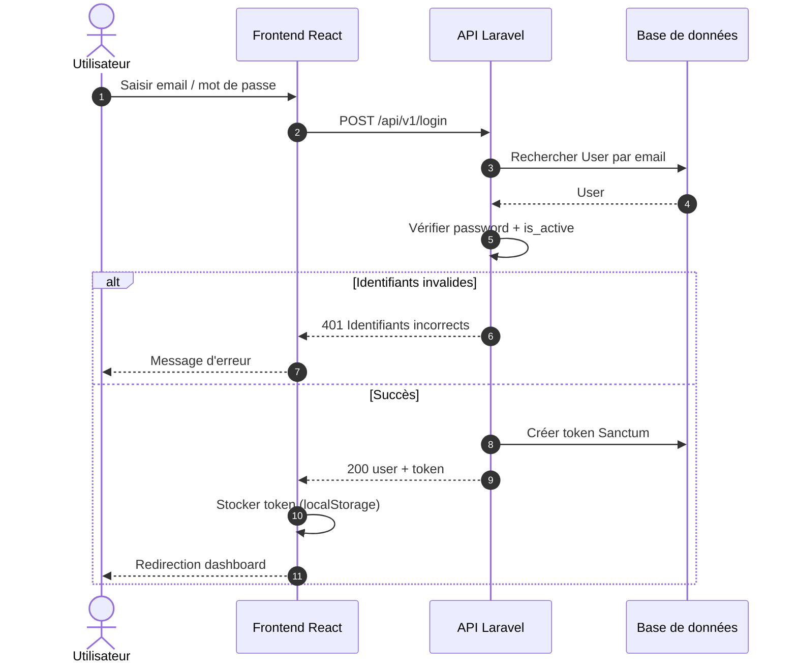
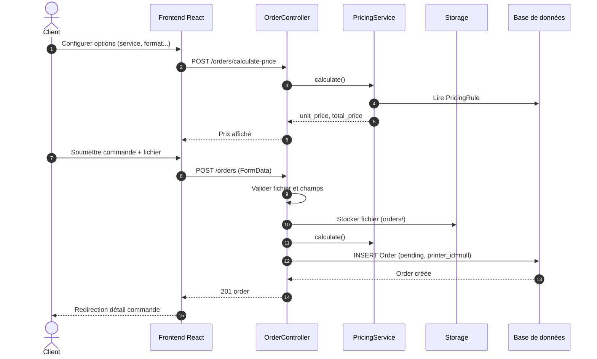
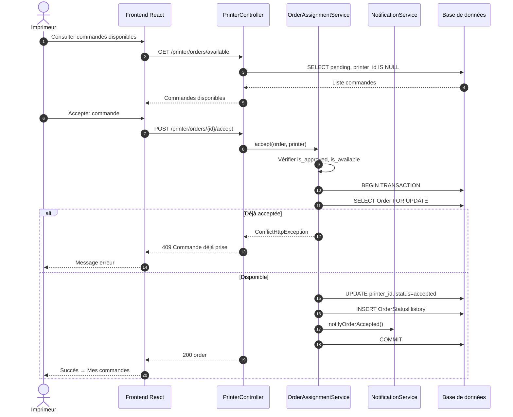
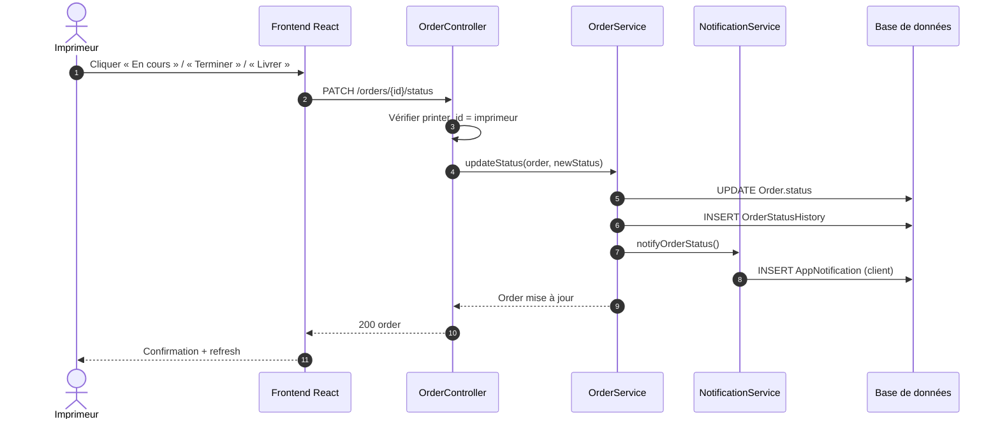
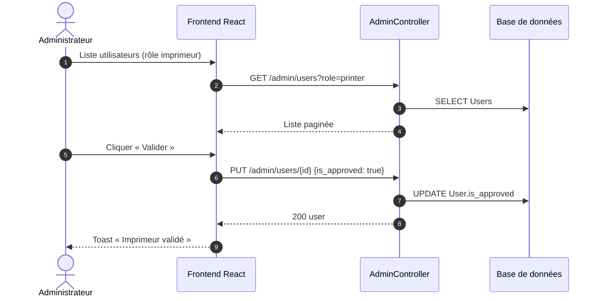
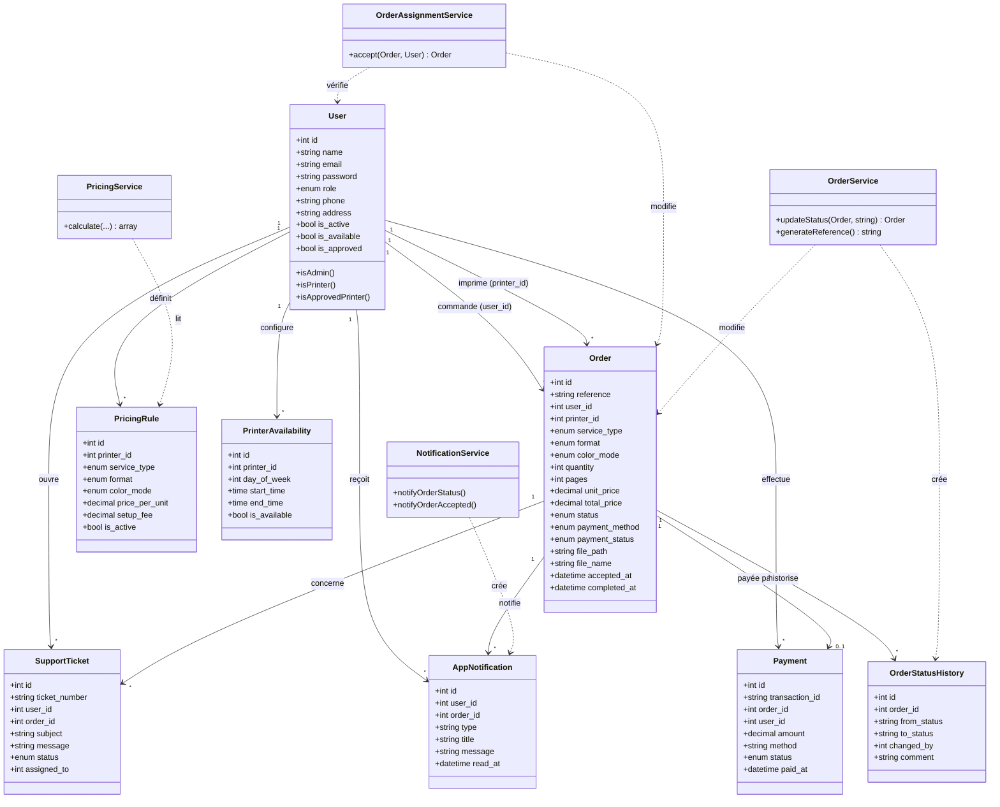

# Cahier d'analyse — PrintEasy

**Plateforme web de gestion des services d'impression, photocopie et scan**

---

## Informations du document

| Champ | Valeur |
|-------|--------|
| **Projet** | PrintEasy |
| **Document** | Cahier d'analyse |
| **Version** | 1.1 |
| **Date** | 2025 |

---

## Sommaire

1. [Modules et fonctionnalités](#i-modules-et-fonctionnalités)
2. [Acteurs / utilisateurs](#ii-acteurs--utilisateurs)
3. [Objets du système](#iii-objets-du-système)
4. [Diagramme de cas d'utilisation](#iv-diagramme-de-cas-dutilisation)
5. [Diagrammes de séquence](#v-diagrammes-de-séquence)
6. [Diagramme de classes](#vi-diagramme-de-classes)
7. [Règles de gestion](#vii-règles-de-gestion)

---

## I. Modules et fonctionnalités

Pour les besoins du système PrintEasy, **5 modules** ont été identifiés :

- **Tableau de bord** — Vue synthétique par rôle (client, imprimeur, admin)
- **Commandes** — Création, file d'attente, attribution, suivi des statuts
- **Paramètres** — Tarifs, disponibilités, profil utilisateur
- **Paiements** — Paiement en ligne simulé, historique, reçus
- **Sécurité** — Authentification, rôles, validation des imprimeurs (module transversal)

| MODULES | FONCTIONNALITÉS |
|---------|-----------------|
| **Tableau de bord** | 1. Afficher les indicateurs clés (commandes en attente, en cours, revenus)<br>2. Accès rapide aux actions principales<br>3. Toggle disponibilité (imprimeur) |
| **Commandes** | 1. Créer une commande (upload fichier, options, calcul prix)<br>2. Consulter la file des commandes disponibles (imprimeur validé)<br>3. Accepter une commande (attribution exclusive, premier arrivé)<br>4. Mettre à jour les statuts (en cours, terminée, livrée)<br>5. Consulter le détail et l'historique des statuts<br>6. Rechercher et filtrer les commandes |
| **Paramètres** | 1. Gérer le profil (nom, téléphone, adresse, mot de passe)<br>2. Définir la grille tarifaire (imprimeur)<br>3. Configurer les horaires de disponibilité (imprimeur) |
| **Paiements** | 1. Payer une commande en ligne (simulé)<br>2. Choisir paiement à la réception<br>3. Consulter l'historique et télécharger un reçu |
| **Sécurité** | 1. Inscription et connexion (Sanctum)<br>2. Gestion des rôles (client, imprimeur, admin)<br>3. Activer / désactiver les comptes<br>4. Valider / révoquer les comptes imprimeur (`is_approved`) |

---

## II. Acteurs / utilisateurs

Le tableau ci-dessous définit les intervenants du système pour chaque module :

| MODULES | INTERVENANTS |
|---------|--------------|
| **Tableau de bord** | Client, Imprimeur, Administrateur |
| **Commandes** | Client, Imprimeur (validé et disponible), Administrateur |
| **Paramètres** | Client, Imprimeur, Administrateur |
| **Paiements** | Client, Administrateur |
| **Sécurité** | Client, Imprimeur, Administrateur |
| **Support / Notifications** | Client, Administrateur |

### Description des acteurs

| Acteur | Description |
|--------|-------------|
| **Client** | Utilisateur qui dépose des fichiers, passe commande, paie et suit l'avancement |
| **Imprimeur** | Prestataire qui consulte la file, accepte des commandes, met à jour les statuts et gère tarifs/disponibilités |
| **Administrateur** | Supervise la plateforme, valide les imprimeurs, modère les comptes et consulte les statistiques globales |
| **Système (API)** | Backend Laravel : validation, calcul des prix, verrouillage d'attribution, notifications |

---

## III. Objets du système

Un **objet** est un élément abstrait du système disposant d'attributs et représentant un ensemble d'entités manipulées par la plateforme.

### Vue d'ensemble des objets

```
User ── Order ── Payment
  │       │
  │       ├── OrderStatusHistory
  │       ├── AppNotification
  │       └── SupportTicket
  ├── PricingRule
  └── PrinterAvailability
```

### Interprétation du schéma des objets

Ce schéma résume les **liens principaux** entre entités :

- **User** est l'entité centrale : un même modèle représente client, imprimeur et admin (discriminé par `role`).
- **Order** relie un **client** (`user_id`) à un **imprimeur** (`printer_id`, optionnel tant que la commande n'est pas acceptée).
- **Payment** est rattaché à une commande et au payeur.
- **OrderStatusHistory**, **AppNotification** et **SupportTicket** gravitent autour de **Order** pour la traçabilité, l'information et le support.
- **PricingRule** et **PrinterAvailability** dépendent de l'imprimeur (User avec rôle `printer`) pour la tarification et les horaires.

---

### User

L'objet **User** représente l'ensemble des utilisateurs gérés dans le système (client, imprimeur, administrateur).

| ATTRIBUTS | TYPE | OBSERVATIONS |
|-----------|------|--------------|
| id | integer | Clé primaire |
| name | string | Nom ou nom de l'imprimerie |
| email | string | Unique |
| password | string | Hashé |
| role | enum | `user`, `printer`, `admin` |
| phone | string | Nullable |
| avatar | string | Nullable |
| address | text | Nullable (obligatoire à l'inscription imprimeur) |
| is_active | boolean | Compte actif |
| is_available | boolean | Imprimeur disponible pour nouvelles commandes |
| is_approved | boolean | Validation admin (imprimeur) |
| email_verified_at | datetime | Nullable |
| created_at / updated_at | datetime | Horodatage |

---

### Order

L'objet **Order** représente une demande d'impression, photocopie ou scan.

| ATTRIBUTS | TYPE | OBSERVATIONS |
|-----------|------|--------------|
| id | integer | Clé primaire |
| reference | string | Unique (ex. PE-XXXXXXXX) |
| user_id | integer | FK → Client commanditaire |
| printer_id | integer | FK → Imprimeur (nullable jusqu'à acceptation) |
| service_type | enum | `print`, `photocopy`, `scan` |
| format | enum | `A4`, `A3`, `A5`, `letter` |
| color_mode | enum | `color`, `bw` |
| quantity | integer | Nombre d'exemplaires |
| pages | integer | Nombre de pages |
| unit_price | decimal | Prix unitaire calculé |
| total_price | decimal | Montant total |
| status | enum | `pending`, `accepted`, `in_progress`, `completed`, `delivered`, `rejected`, `cancelled` |
| payment_method | enum | `online`, `on_delivery` |
| payment_status | enum | `unpaid`, `pending`, `paid`, `refunded` |
| file_path | string | Chemin stockage |
| file_name | string | Nom original du fichier |
| file_type | string | MIME type |
| file_size | integer | Octets |
| notes | text | Nullable |
| rejection_reason | text | Nullable |
| accepted_at | datetime | Date d'acceptation par l'imprimeur |
| completed_at | datetime | Nullable |
| created_at / updated_at | datetime | Horodatage |

---

### PricingRule

L'objet **PricingRule** représente une règle tarifaire définie par un imprimeur.

| ATTRIBUTS | TYPE | OBSERVATIONS |
|-----------|------|--------------|
| id | integer | Clé primaire |
| printer_id | integer | FK → User (imprimeur), nullable = tarif global |
| service_type | enum | print, photocopy, scan |
| format | enum | A4, A3, A5, letter |
| color_mode | enum | color, bw |
| price_per_unit | decimal | Prix par unité/page |
| setup_fee | decimal | Frais fixes |
| is_active | boolean | Règle active |

---

### PrinterAvailability

L'objet **PrinterAvailability** représente les créneaux horaires d'un imprimeur.

| ATTRIBUTS | TYPE | OBSERVATIONS |
|-----------|------|--------------|
| id | integer | Clé primaire |
| printer_id | integer | FK → User |
| day_of_week | integer | 0 (dimanche) à 6 (samedi) |
| start_time | time | Heure d'ouverture |
| end_time | time | Heure de fermeture |
| is_available | boolean | Jour actif |

---

### Payment

L'objet **Payment** représente une transaction financière liée à une commande.

| ATTRIBUTS | TYPE | OBSERVATIONS |
|-----------|------|--------------|
| id | integer | Clé primaire |
| transaction_id | string | Identifiant unique |
| order_id | integer | FK → Order |
| user_id | integer | FK → User (payeur) |
| amount | decimal | Montant |
| method | string | mobile_money, stripe, etc. |
| status | enum | pending, completed, failed, refunded |
| provider_reference | string | Nullable |
| metadata | json | Données complémentaires |
| receipt_path | string | Chemin reçu PDF |
| paid_at | datetime | Nullable |

---

### OrderStatusHistory

L'objet **OrderStatusHistory** trace chaque changement de statut d'une commande.

| ATTRIBUTS | TYPE | OBSERVATIONS |
|-----------|------|--------------|
| id | integer | Clé primaire |
| order_id | integer | FK → Order |
| from_status | string | Statut précédent |
| to_status | string | Nouveau statut |
| changed_by | integer | FK → User (nullable) |
| comment | text | Nullable |
| created_at | datetime | Horodatage |

---

### AppNotification

L'objet **AppNotification** représente une notification in-app pour un utilisateur.

| ATTRIBUTS | TYPE | OBSERVATIONS |
|-----------|------|--------------|
| id | integer | Clé primaire |
| user_id | integer | FK → User |
| order_id | integer | FK → Order (nullable) |
| type | string | order_status, order_accepted, etc. |
| title | string | Titre |
| message | text | Contenu |
| data | json | Données additionnelles |
| read_at | datetime | Nullable |

---

### SupportTicket

L'objet **SupportTicket** représente une demande d'assistance.

| ATTRIBUTS | TYPE | OBSERVATIONS |
|-----------|------|--------------|
| id | integer | Clé primaire |
| ticket_number | string | Référence unique |
| user_id | integer | FK → User |
| order_id | integer | FK → Order (nullable) |
| subject | string | Objet |
| message | text | Message initial |
| priority | enum | low, medium, high |
| status | enum | open, in_progress, resolved, closed |
| assigned_to | integer | FK → User admin (nullable) |
| admin_reply | text | Nullable |

---

> **Note :** Toutes les tables incluent `id` (clé primaire) et `created_at` / `updated_at`. Les comptes utilisent `is_active` pour la désactivation et `is_approved` pour la validation des imprimeurs.

---

## IV. Diagramme de cas d'utilisation

### Diagramme



```mermaid
flowchart TB
    subgraph Acteurs
        C((Client))
        I((Imprimeur))
        A((Administrateur))
    end

    subgraph PrintEasy["Système PrintEasy"]
        subgraph Auth["Sécurité"]
            UC1[S'inscrire]
            UC2[Se connecter]
            UC3[Gérer son profil]
        end

        subgraph Cmd["Commandes"]
            UC4[Créer une commande]
            UC5[Suivre une commande]
            UC6[Consulter commandes disponibles]
            UC7[Accepter une commande]
            UC8[Mettre à jour le statut]
        end

        subgraph Pay["Paiements"]
            UC9[Payer en ligne]
            UC10[Consulter historique paiements]
        end

        subgraph Param["Paramètres"]
            UC11[Gérer tarifs]
            UC12[Gérer disponibilités]
            UC13[Toggle disponibilité]
        end

        subgraph Admin["Administration"]
            UC14[Valider imprimeur]
            UC15[Gérer utilisateurs]
            UC16[Superviser commandes]
            UC17[Dashboard global]
            UC18[Répondre support]
        end

        subgraph Notif["Notifications"]
            UC19[Recevoir notifications]
            UC20[Ouvrir ticket support]
        end
    end

    C --> UC1
    C --> UC2
    C --> UC3
    C --> UC4
    C --> UC5
    C --> UC9
    C --> UC10
    C --> UC19
    C --> UC20

    I --> UC1
    I --> UC2
    I --> UC3
    I --> UC6
    I --> UC7
    I --> UC8
    I --> UC11
    I --> UC12
    I --> UC13
    I --> UC19

    A --> UC2
    A --> UC14
    A --> UC15
    A --> UC16
    A --> UC17
    A --> UC18
```

### Interprétation du diagramme de cas d'utilisation

#### Périmètre du système

Le rectangle **« Système PrintEasy »** représente la frontière applicative : tout ce qui est à l'intérieur est réalisé par la plateforme (frontend React + API Laravel). Les **acteurs** sont à l'extérieur : ils déclenchent les cas d'utilisation sans en implémenter la logique métier.

#### Les trois acteurs

| Acteur | Rôle dans le diagramme |
|--------|------------------------|
| **Client** | Consommateur du service : il commande, paie, suit et demande de l'aide. Il n'accepte ni ne traite les commandes des autres. |
| **Imprimeur** | Producteur du service : il prend des commandes dans la file commune, les traite et configure son activité (tarifs, horaires). |
| **Administrateur** | Superviseur : il ne passe pas de commandes mais contrôle les comptes, valide les imprimeurs et supervise l'ensemble. |

#### Packages fonctionnels (regroupements)

1. **Sécurité** — Fonctions transverses d'accès : inscription (UC1), connexion (UC2), profil (UC3). Le client et l'imprimeur s'inscrivent ; l'admin se connecte uniquement (compte créé en amont).

2. **Commandes** — Cœur métier :
   - **UC4–UC5** : réservés au **client** (création et suivi).
   - **UC6–UC8** : réservés à l'**imprimeur** (file, acceptation, évolution des statuts).
   - L'**admin** supervise via **UC16** sans être sur le chemin nominal client/imprimeur.

3. **Paiements** — **UC9–UC10** : exclusivement côté **client** ; l'admin consulte les paiements via le dashboard global (UC17), pas via un cas dédié « payer ».

4. **Paramètres** — **UC11–UC13** : réservés à l'**imprimeur** (tarifs, créneaux, disponibilité instantanée).

5. **Administration** — **UC14–UC18** : réservés à l'**admin** (validation imprimeur, gestion users, supervision, support).

6. **Notifications** — **UC19** : client et imprimeur ; **UC20** : client ouvre un ticket, admin répond (UC18).

#### Flux métier principal (lecture du diagramme)

```
Client : S'inscrire → Se connecter → Créer commande → Suivre / Payer
                              ↓
Imprimeur : (Validé par admin) → Consulter file → Accepter → Mettre à jour statut
                              ↓
Client : Reçoit notification → Voit imprimeur assigné → Suivi jusqu'à « Livrée »
```

#### Point clé : séparation des responsabilités

- Un **client** ne peut pas **accepter** une commande (UC7) : cela évite les conflits d'attribution.
- Un **imprimeur** non validé n'a pas accès à UC6/UC7 (prérequis `is_approved` — règle métier en dehors du diagramme, mais implicite).
- L'**admin** n'intervient pas dans le flux opérationnel quotidien des commandes, sauf supervision (UC16) et validation (UC14).

### Tableau récapitulatif des cas d'utilisation

| ID | Cas d'utilisation | Acteur(s) | Module |
|----|-------------------|-----------|--------|
| UC1 | S'inscrire | Client, Imprimeur | Sécurité |
| UC2 | Se connecter | Tous | Sécurité |
| UC3 | Gérer son profil | Client, Imprimeur | Paramètres |
| UC4 | Créer une commande | Client | Commandes |
| UC5 | Suivre une commande | Client | Commandes |
| UC6 | Consulter commandes disponibles | Imprimeur | Commandes |
| UC7 | Accepter une commande | Imprimeur | Commandes |
| UC8 | Mettre à jour le statut | Imprimeur | Commandes |
| UC9 | Payer en ligne | Client | Paiements |
| UC10 | Consulter historique paiements | Client | Paiements |
| UC11 | Gérer tarifs | Imprimeur | Paramètres |
| UC12 | Gérer disponibilités | Imprimeur | Paramètres |
| UC13 | Toggle disponibilité | Imprimeur | Tableau de bord |
| UC14 | Valider imprimeur | Admin | Sécurité |
| UC15 | Gérer utilisateurs | Admin | Sécurité |
| UC16 | Superviser commandes | Admin | Commandes |
| UC17 | Dashboard global | Admin | Tableau de bord |
| UC18 | Répondre support | Admin | Support |
| UC19 | Recevoir notifications | Client, Imprimeur | Notifications |
| UC20 | Ouvrir ticket support | Client | Support |

---

## V. Diagrammes de séquence

> **Légende commune** : Les flèches pleines (`→`) représentent un appel ou un envoi de données ; les flèches en pointillé (`-->>`) représentent une réponse. Le bloc `alt` indique une alternative (succès ou échec). Les numéros (`autonumber`) ordonnent chronologiquement les échanges.

---

### 1. Sécurité — Connexion utilisateur

#### Diagramme



#### Interprétation du diagramme de séquence — Connexion

| Étape | Élément | Signification |
|-------|---------|---------------|
| **1** | Utilisateur → Frontend | Saisie des identifiants sur la page `/login`. L'acteur humain initie le scénario. |
| **2** | Frontend → API | Requête HTTP `POST /api/v1/login` avec JSON `{ email, password }`. Le frontend ne vérifie pas le mot de passe : il délègue au serveur. |
| **3–4** | API → DB → API | Recherche de l'utilisateur par e-mail. Si l'e-mail n'existe pas, la branche « identifiants invalides » est prise. |
| **5** | API (auto-appel) | Comparaison du hash du mot de passe et vérification de `is_active`. Un compte désactivé doit être rejeté même avec un bon mot de passe. |
| **alt – échec** | API → Frontend → Utilisateur | Code **401** : aucun token n'est délivré. L'utilisateur reste sur la page de connexion avec un message d'erreur. |
| **alt – succès** | API → DB | Création d'un **token Sanctum** lié à l'utilisateur (session API stateless). |
| **7–8** | API → Frontend | Réponse **200** contenant `user` (profil) et `token` (chaîne Bearer). |
| **9** | Frontend (auto) | Stockage du token dans `localStorage` pour les requêtes suivantes (en-tête `Authorization: Bearer …`). |
| **10** | Frontend → Utilisateur | Redirection vers `/dashboard`, `/printer/dashboard` ou `/admin/dashboard` selon `user.role`. |

**Conclusion :** Ce diagramme montre que l'authentification est **entièrement centralisée côté API** ; le frontend ne fait que transporter les identifiants et conserver le jeton.

---

### 2. Commandes — Création d'une commande (client)

#### Diagramme



#### Interprétation du diagramme de séquence — Création commande

**Phase A — Calcul du prix (étapes 1–6)**

- Le client modifie les options (service, format, couleur, quantité, pages) **sans encore valider** la commande.
- À chaque changement, le frontend appelle `calculate-price` : c'est un **aperçu tarifaire** en temps réel.
- **PricingService** interroge les règles tarifaires (`PricingRule`) ou applique des valeurs par défaut, puis renvoie `unit_price` et `total_price`.
- Aucune commande n'est créée à ce stade : pas d'écriture durable sauf lecture des tarifs.

**Phase B — Soumission définitive (étapes 7–14)**

| Étape | Interprétation |
|-------|----------------|
| **7–8** | Le client envoie le formulaire **multipart** (fichier + champs). Le fichier voyage dans le corps HTTP, pas en JSON. |
| **9** | **Validation Laravel** : type de fichier, taille max 20 Mo, champs obligatoires. En cas d'échec → 422 sans stockage. |
| **10** | **Storage** : le fichier est enregistré sur le disque (`storage/app/public/orders/…`). Le chemin sera sauvegardé dans `Order.file_path`. |
| **11** | Recalcul du prix au moment de la création (cohérence avec les options finales). |
| **12** | **INSERT** avec `status = pending` et **`printer_id = null`** : la commande entre dans la **file d'attente commune** ; aucun imprimeur n'est présélectionné. |
| **13–14** | Réponse **201 Created** ; le client est redirigé vers la page de détail pour suivre sa commande. |

**Conclusion :** La création sépare clairement **prévisualisation du prix** et **persistance de la commande**. L'absence de `printer_id` est volontaire et prépare le scénario d'acceptation par un imprimeur.

---

### 3. Commandes — Acceptation d'une commande (imprimeur)

#### Diagramme



#### Interprétation du diagramme de séquence — Acceptation

**Phase A — Consultation de la file (étapes 1–5)**

- Seules les commandes **`pending`** avec **`printer_id` IS NULL** sont retournées.
- Prérequis côté imprimeur (vérifiés avant la liste) : `is_approved`, `is_active`, `is_available`.
- Plusieurs imprimeurs peuvent voir **la même liste** en parallèle : la course à l'acceptation est possible.

**Phase B — Acceptation exclusive (étapes 6–fin)**

| Élément | Interprétation |
|---------|----------------|
| **OrderAssignmentService** | Encapsule la logique « premier arrivé, premier servi ». Le contrôleur HTTP délègue tout le travail critique à ce service. |
| **BEGIN TRANSACTION** | Début d'une unité de travail atomique : soit tout réussit, soit tout est annulé. |
| **SELECT … FOR UPDATE** | **Verrouillage pessimiste** : si deux imprimeurs acceptent en même temps, le second attend puis voit que `printer_id` n'est plus null. |
| **alt – Déjà acceptée** | HTTP **409 Conflict** : message explicite pour l'imprimeur (« déjà prise par un autre »). Aucune double attribution. |
| **alt – Disponible** | Mise à jour : `printer_id` = imprimeur courant, `status` = `accepted`, `accepted_at` = maintenant. |
| **OrderStatusHistory** | Trace audit : passage `pending` → `accepted` avec `changed_by` = imprimeur. |
| **NotificationService** | Le **client** est informé que son commande a été prise en charge ; l'**imprimeur** reçoit une confirmation. |
| **COMMIT** | Validation définitive en base. La commande **disparaît** de la file des autres imprimeurs. |

**Conclusion :** Ce diagramme est la **preuve technique** de la règle métier n°6 (attribution exclusive). Le point critique est le couple **transaction + FOR UPDATE**.

---

### 4. Commandes — Mise à jour du statut (imprimeur)

#### Diagramme



#### Interprétation du diagramme de séquence — Mise à jour statut

| Étape | Interprétation |
|-------|----------------|
| **1** | L'imprimeur déclenche une transition : `accepted` → `in_progress` → `completed` → `delivered`. |
| **2** | `PATCH /orders/{id}/status` avec body `{ status: "…" }`. |
| **3** | **Contrôle d'autorisation** : `order.printer_id` doit égaler l'ID de l'imprimeur connecté. Sinon → **403** (un autre imprimeur ne peut pas modifier cette commande). |
| **4–5** | **OrderService** met à jour le statut courant et enregistre l'**historique** (traçabilité complète pour le client). |
| **6–7** | **NotificationService** crée une notification pour le **client** (et éventuellement l'imprimeur) : le suivi en temps réel est alimenté. |
| **8–10** | Réponse avec la commande à jour ; l'interface se rafraîchit (badge de statut, historique). |

**Cycle couvert par ce diagramme :**

```
accepted ──► in_progress ──► completed ──► delivered
```

**Conclusion :** Après l'acceptation, la commande sort de la logique de file commune et entre dans un **workflow privé** entre le client et l'imprimeur attributaire. Chaque changement est notifié et historisé.

---

### 5. Sécurité — Validation d'un imprimeur (admin)

#### Diagramme



#### Interprétation du diagramme de séquence — Validation imprimeur

| Phase | Interprétation |
|-------|----------------|
| **Consultation (1–5)** | L'admin filtre les comptes `role = printer`. Il identifie ceux avec `is_approved = false` (inscription récente). |
| **Validation (6–10)** | Un simple `PUT` met `is_approved` à `true`. **Aucune** modification de commande à ce stade. |
| **Effet métier** | Dès la validation, l'imprimeur peut accéder à **UC6** et **UC7** (file + acceptation), s'il est aussi `is_active` et `is_available`. |
| **Révocable** | Le même écran permet `is_approved: false` (révoquer), ce qui le retire de la file sans supprimer son compte. |

**Conclusion :** Ce diagramme modélise la **porte d'entrée** des imprimeurs vers le marché des commandes. Sans cette étape, un imprimeur inscrit reste bloqué avec le message « en attente de validation ».

---

## VI. Diagramme de classes

Ce diagramme complète la modélisation UML initiée par le **cas d'utilisation** (section IV) et les **diagrammes de séquence** (section V). Il décrit la structure statique des données et des services métier.

### Diagramme



### Interprétation du diagramme de classes

#### 1. Entités persistantes (modèles Eloquent)

| Classe | Rôle dans le modèle |
|--------|---------------------|
| **User** | Entité pivot. Un même modèle matérialise client, imprimeur et admin. Les méthodes `isAdmin()`, `isPrinter()`, `isApprovedPrinter()` expriment le comportement selon le rôle sans sous-classes. |
| **Order** | Agrégat central du métier. Contient le cycle de vie (`status`), les liens client/imprimeur, le fichier et les montants. C'est l'objet le plus consulté et le plus modifié. |
| **PricingRule** | Paramétrage tarifaire par imprimeur (ou global si `printer_id` null). Clé composite logique : service + format + couleur. |
| **PrinterAvailability** | Créneaux horaires récurrents par jour de semaine. Complète le booléen `is_available` (disponibilité instantanée). |
| **Payment** | Transaction financière **optionnelle** (0..1 par commande). Sépare la logique paiement de la commande elle-même. |
| **OrderStatusHistory** | Journal des transitions de statut — indispensable pour l'audit et l'affichage « historique » côté client. |
| **AppNotification** | Message in-app lié à un utilisateur et éventuellement à une commande. |
| **SupportTicket** | Demande d'aide ; peut référencer une commande et un admin assigné (`assigned_to`). |

#### 2. Services métier (couche application)

Les classes avec une liaison en pointillés (`..>`) sont des **services** : elles ne sont pas des tables en base, mais de la **logique applicative**.

| Service | Responsabilité |
|---------|----------------|
| **OrderAssignmentService** | Méthode `accept()` : vérifie l'imprimeur, verrouille la commande, attribue `printer_id`, notifie. Correspond au diagramme de séquence §3. |
| **OrderService** | `updateStatus()` et `generateReference()` : évolution du workflow et génération de référence unique (PE-XXXXXXXX). |
| **PricingService** | `calculate()` : lecture des `PricingRule` et calcul du montant. Utilisé à la création et pour l'aperçu prix. |
| **NotificationService** | Création des `AppNotification` et envoi e-mail simulé lors des changements de statut ou acceptation. |

#### 3. Interprétation des cardinalités (associations)

| Association | Cardinalité | Signification |
|-------------|-------------|---------------|
| User → Order (user_id) | 1 → * | Un client commande **plusieurs** fois ; chaque commande a **un** client. |
| User → Order (printer_id) | 1 → * | Un imprimeur traite **plusieurs** commandes ; une commande a **au plus un** imprimeur (0 avant acceptation). |
| Order → Payment | 1 → 0..1 | Une commande peut ne pas encore être payée ; un paiement ne concerne qu'**une** commande. |
| Order → OrderStatusHistory | 1 → * | Chaque changement de statut ajoute une ligne d'historique. |
| User → PricingRule | 1 → * | Grille tarifaire personnalisée par imprimeur. |
| User → PrinterAvailability | 1 → * | Plusieurs jours configurés par imprimeur. |

#### 4. Double rôle de User sur Order

Le diagramme montre **deux associations** entre `User` et `Order` :

- **`user_id`** : le **donneur d'ordre** (client).
- **`printer_id`** : l'**exécutant** (imprimeur).

C'est une modélisation classique en « double FK vers la même table ». En lecture métier : « qui a commandé ? » vs « qui imprime ? ».

#### 5. Cohérence avec la base de données

Chaque classe persistante correspond à une table (voir tableau ci-dessous). Les services n'ont pas de table dédiée : ils orchestrent les modèles existants.

### Correspondance classes ↔ tables BDD

| Classe | Table |
|--------|-------|
| User | users |
| Order | orders |
| PricingRule | pricing_rules |
| PrinterAvailability | printer_availabilities |
| Payment | payments |
| OrderStatusHistory | order_status_histories |
| AppNotification | app_notifications |
| SupportTicket | support_tickets |

### Synthèse visuelle du diagramme de classes

```
                    ┌─────────────────┐
                    │     User        │
                    └────────┬────────┘
           ┌─────────────────┼─────────────────┐
           ▼                 ▼                 ▼
    ┌──────────────┐  ┌─────────────┐  ┌──────────────────┐
    │ PricingRule  │  │    Order    │  │PrinterAvailability│
    └──────────────┘  └──────┬──────┘  └──────────────────┘
                             │
              ┌──────────────┼──────────────┐
              ▼              ▼              ▼
       ┌──────────┐  ┌──────────────┐  ┌─────────────┐
       │ Payment  │  │StatusHistory │  │Notification │
       └──────────┘  └──────────────┘  └─────────────┘

    Services (logique) : OrderAssignmentService, OrderService,
                         PricingService, NotificationService
```

---

## VII. Règles de gestion

Les règles de gestion définissent les relations entre les objets du système et formalisent les contraintes métier du système et complètent la modélisation UML présentée ci-dessus.

1. Un **utilisateur** peut être client, imprimeur ou administrateur (attribut `role`).
2. Un **client** passe **plusieurs commandes** ; une commande appartient à **un seul client**.
3. Une **commande** peut être assignée à **un imprimeur** (`printer_id`) ; un imprimeur traite **plusieurs commandes**.
4. À la création, une commande est en statut `pending` avec `printer_id = null` (file d'attente ouverte).
5. Seul un imprimeur `is_approved`, `is_active` et `is_available` peut accepter des commandes.
6. L'acceptation est **exclusive** : une seule acceptation enregistrée (verrouillage BDD).
7. Une commande possède **au plus un paiement** ; un paiement est lié à **une commande** et **un utilisateur**.
8. Une commande génère **plusieurs entrées** dans l'historique des statuts.
9. Un **imprimeur** définit **plusieurs règles tarifaires** (combinaison service/format/couleur).
10. Un **imprimeur** configure **plusieurs créneaux** de disponibilité (par jour de la semaine).
11. Un **utilisateur** reçoit **plusieurs notifications** ; une notification peut référencer une commande.
12. Un **utilisateur** peut ouvrir **plusieurs tickets** support ; un ticket peut être lié à une commande.
13. Le **calcul du prix** s'appuie sur les tarifs de l'imprimeur assigné, sinon tarifs globaux, sinon valeurs par défaut.
14. Le cycle de statut suit : `pending` → `accepted` → `in_progress` → `completed` → `delivered`.
15. Fichiers acceptés : pdf, doc, docx, jpg, jpeg, png — taille maximale 20 Mo.

---

*PrintEasy © 2025 — Projet académique*  
*Cahier d'analyse — Tous les diagrammes (cas d'utilisation, séquences, classes) sont accompagnés de leur interprétation textuelle.*
